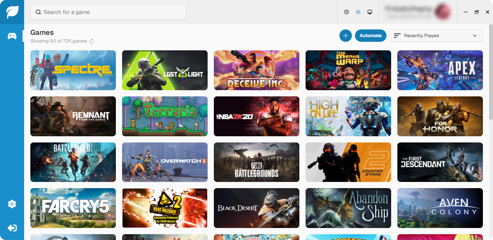

  
  <h1 align="center">Steam Game Idler + Achievement Unlocker</h1>
  
Idle and unlock achievements for any game in your Steam library. All you need is your Steam profile name or ID64. No password, token, or any other login information needed.

  
  
  
  

  

# Download
All the latest windows supported versions of SGI can be downloaded from the [releases page](https://github.com/probablyraging/steam-game-idler/releases) 
Looking for a linux/macos supported version? Take a look at the [CLI + Web UI](https://github.com/probablyraging/steam-game-idler/tree/cli-webui) branch

### Options
* **[Portable](https://github.com/probablyraging/steam-game-idler)**: `.exe` file, works on most win10/win11 systems *(check the note below)*
* **[Installer](https://github.com/probablyraging/steam-game-idler)**: `.msi` file, includes all dependencies and automatic updates, **recommended** for all windows versions
* **[Lite](https://github.com/probablyraging/steam-game-idler/tree/lite)**: simplified version with no achievement unlocker, minimal UI, only requires a game ID, no Steam profile name or ID64 needed
* **[CLI + Web UI](https://github.com/probablyraging/steam-game-idler/tree/cli-webui)**: windows, linux, and macos supported version with a command-line interface and/or web interface

> [!Note]
> ***PORTABLE** requires the [WebView2](https://developer.microsoft.com/en-us/microsoft-edge/webview2/?form=MA13LH#download-section) runtime which is distributed as part of the OS on Win10 (version 1803 and later with all updates applied) and Win11. Use the MSI installer if you're unsure, as it comes bundled with all dependencies.*

# Build It Yourself
1. **Clone**: `git clone https://github.com/probablyraging/steam-game-idler.git`
2. **Install deps**: `cd ./steam-game-idler` & `npm install`
3. **Build idler**: `msbuild ./idler-csharp/idler.csproj`
	* Output to `/libs` dir in `/src-tauri`
4. **Build achievement unlocker**: `msbuild ./achievement-unlocker-chsarp/AchievementUnlocker.csproj`
	* Output to `/libs` dir in `/src-tauri`
5. **Build app**: `npm run tauri build`
6. **Check console output** for build dir *(usually `/src-tauri/target/release/bundle`)*

# Usage
*The Steam desktop app needs to be running*
1. Enter your Steam profile name or [SteamID64](https://steamid.io/)
2. Click one or more games that you want to idle or click the trophy button on a game card to unlock achievements
3. That's it!

# License
All versions of SGI are licensed under the **[GPL-3.0 License](./LICENSE)**