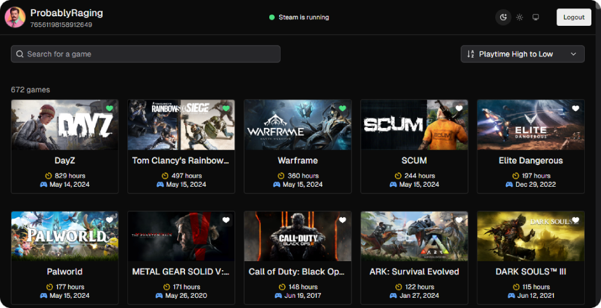

<p align="center">

 <h1 align="center">Steam Game Idler</h1>
 <p align="center">Idle any game in your Steam library. All you need is your Steam username or ID64. No password, token, or any other login information needed.</p>
 <p align="center">Built with NextJS + Tauri.</p>
</p>
  <p align="center">
    <a href="https://github.com/anuraghazra/github-readme-stats/graphs/contributors">
      
    </a>
    <a href="https://github.com/anuraghazra/github-readme-stats/issues">
      
    </a>
    <a href="https://github.com/anuraghazra/github-readme-stats/pulls">
      
    </a>
  </p>

# Portable Executable
Download the latest `.zip` release from [Releases](https://github.com/ProbablyRaging/steam-game-idler/releases)

*[WebView2](https://developer.microsoft.com/en-us/microsoft-edge/webview2/?form=MA13LH#download-section) required. On Windows 10 (Version 1803 and later with all updates applied) and Windows 11, the WebView2 runtime is distributed as part of the operating system. **Use the MSI Installer if you're unsure, as it comes bundled with all dependencies.***

# MSI Installer
Download the latest `.msi` release from [Releases](https://github.com/ProbablyRaging/steam-game-idler/releases)

# Build It Yourself
1. Clone the repoistory
```
git clone https://github.com/ProbablyRaging/steam-game-idler.git
```
2. Install dependencies
```
npm install
```
3. Build the app
```
npm run tauri build
```
4. Check the console output for build directory *(usually `/src-tauri/target/release/bundle`)*

# Usage
1. Enter your Steam username or [SteamID64](https://steamid.io/)
2. Make sure Steam is running
3. Click one or more games that you want to idle
4. That's it, it's that simple