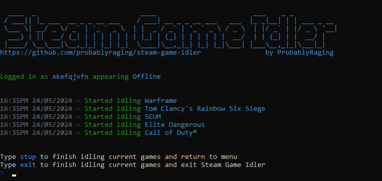
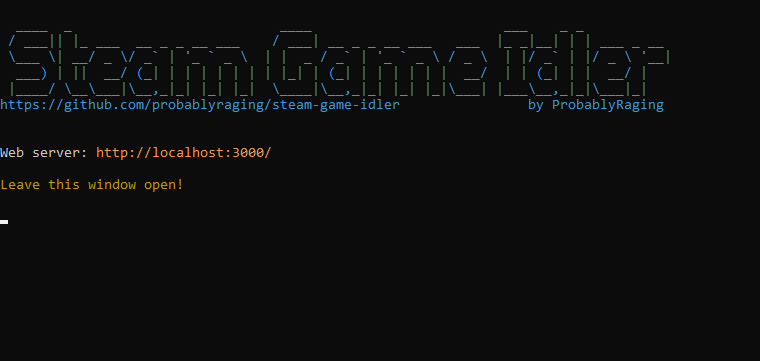

  
  <h1 align="center">Steam Game Idler - CLI + WebUI</h1>
  
Idle any game in your Steam library on windows, linux and macos.

  
  
  
  

  
  

# Prerequisite
- Node.js v18.0.0+
- npm 10.5.1+
- Should run on most versions of linux, macos and windows

# Build It Yourself
1. **Clone**: `git clone -b cli-webui https://github.com/ProbablyRaging/steam-game-idler.git`
2. **Install deps for CLI**: `cd ./steam-game-idler && npm install`
3. **Install deps for web server**: `cd ./steam-game-idler/src && npm install`
4. **Run the CLI**: `node ./index.js`
5. Follow the steps in the terminal to choose between either running the CLI or web UI

# Updates
SGI will check for updates at runtime, if one is available you will be notified
**When an update is available**: `git pull && npm install`
**Delete outdated config**: `rm -r ./config.json`
**Rebuild web server**: `node ./index.js --rebuild`

# License
All versions of SGI are licensed under the **[GPL-3.0 License](./LICENSE)**